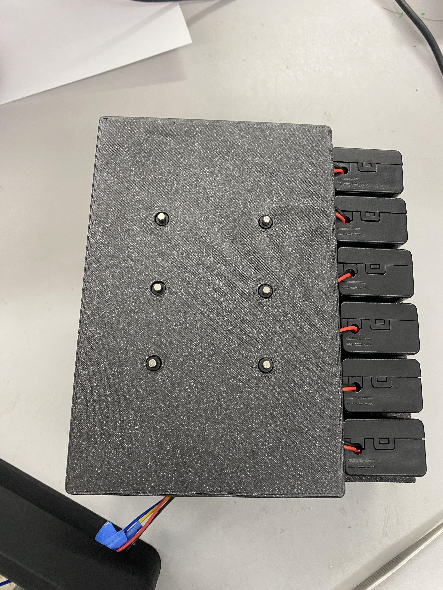

# Invention, Intellectual Property and Income

## Project Video

<video width="900" height="600" controls><source src="../../../presentation.mp4" type="video/mp4" /></video>

## Project Slide

## Dissemination

I believe that my final project has the potential to significantly impact the accessibility of printed materials for visually impaired individuals. After Fab Academy, I plan to work with the American Foundation for the Blind (AFB) along with local groups to continue the development of my project and test the BrailleBox in real-world settings. These partnerships will help refine the device based on feedback and promote its adoption. I will also attempt to shave off as much cost as possible from the device's production. This will hopefully allow large-scale usage and/or production of the Box.

## Future Development

I already have a couple of ideas that I want to implement in the future:

 - Add a button trigger for OCR
 - Power the ESP32CAM through a battery, making it wireless from the rest of the system
 - Design an in-air suspension case for the ESP32CAM to sit above books
 - Replace the Raspberry Pi with the Pico to decrease production cost (lots of difficult re-coding for memory purposes)
 - Modify the AI prompt to be able to describe images and scenes to the visually impaired
